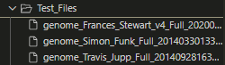
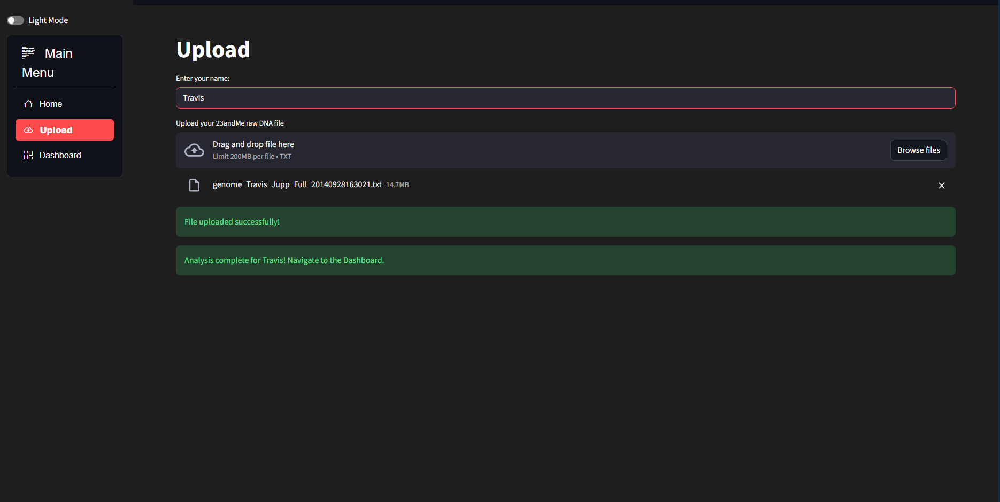
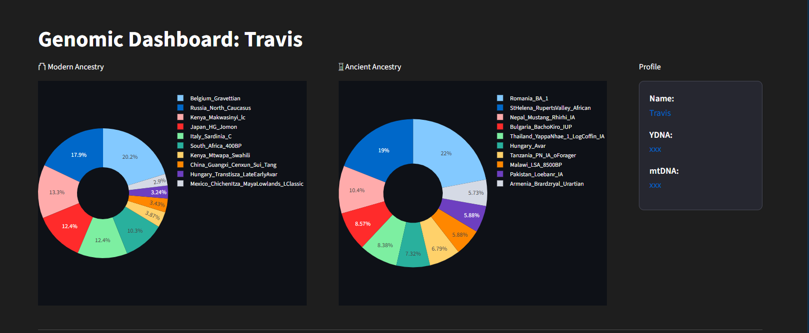
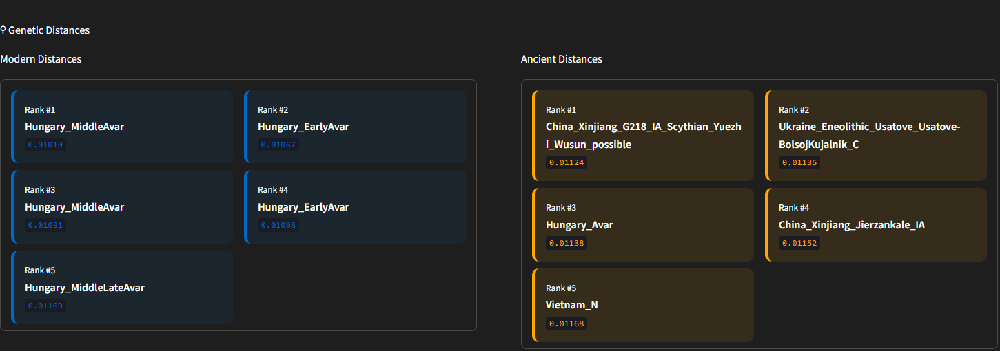
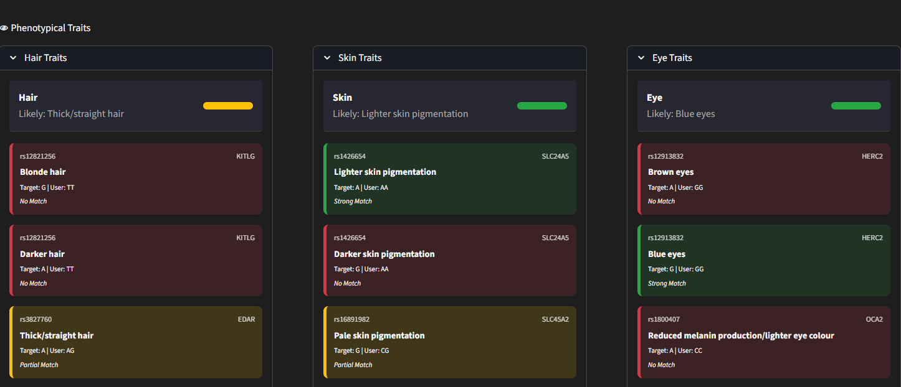

# HaploAI App

A Python-based bioinformatics tool built with Streamlit that allows users to upload raw 23andMe data, to generate personalizsd ancestry and health marker reports using PLINK.

## Technologies Used
- **Python** - Core programming language used for the backend logic.
- **Streamlit** - Python framework used to create the interactive web interface and dashboard.
- **PLINK** Bioinformatics tool used for genotype manipulation and PCA.
- **Pandas/NumPy** - Used for data processing and calculations.
- **Plotly** - Used for creating scatter plots and pie charts.
- **Scikit-Learn** - Used for data scaling & transformations.
- **Subprocess** - Used to execite PLINK externally within Python.

## Features

### User Data Processing
- Users upload a text file. The system filters for overlapping SNPs between the user data and the reference panel.
- Duplicate markers and low-quality ones are removed automatically to ensure accuracy.
- PCA is calculated to project the user onto a reference map.

### Health/Phenotype Analysis
- Every marker in the users .txt file is checked against a database of known markers.
- Results are sorted by Status:
- Status 2: Strong match.
- Status 1: Partial match.
- Status 0/-1: No match or missing data.

### Styling
- Base Streamlit UI.
- Custom CSS injections for personalised app style.

### Cross-Platform Support
- The app detects whether it is running on Linux (Streamlit Cloud) or Windows (Local).
 
## Getting Started
- The app can be run locally or online.
### 1. Online
1. Visit the app online:
```
https://haplo-ai.streamlit.app/
```
2. You will be directed to the home page. You can navigate to other pages on the sidebar on the left.


3. Navigate to the upload page. You can upload your own file if you have it. Otherwise, if you'd like to test it out, you can use on of the three test files in the **"Test_Files"** folder.


4. Enter your name and upload the file, whether your own or one of the test files. You will initially see a success message if you've uploaded correctly. The file will then process displaying a processing message before a success message once complete.


5. Once you see the success message head over to the dashboard tab by clicking on the sidebar on the left to see your results.
 

### 2. Running Locally

1. Clone the repository:

```bash
git clone https://github.com/shass005/HaploAI.git
cd HaploAI
```
2. Install dependencies 
```bash
pip install -r requirements.txt
```
4. Run the server

- You can run either by:
```
streamlit run HaploAI.py
``` 
- Or, if the former doesn't work:
```
python -m streamlit run HaploAI.py  
```
5. Open your browser
- Visit: http://localhost:8501

The app should be rendered. You can follow the same steps detailed in the online section to use the app.

### Results
- The results displayed in the dashboard are divided into four sections.
- Section 1:
This section models the ancestry on the user whose file was uploaded using modern and ancient samples.

- Section 2: 
This section shows the proximity of the uploaded sample to the top 5 modern and ancient samples.

- Section 3: This section shows the presence of markers in the users file compared to a set of defined markers that are phenotypically informative for skin, eye, and hair traits. The users most likely trait for each of the three category is displayed at the top. Each marker is color coded.
    - Green = Strong Match
    - Yellow = Partial Match
    - Red = No Match

- Section 4: This section shows the presence of markers in the users file compared to a set of defined markers that are phenotypically informative for health traits. Each marker is color coded.
    - Green = Strong Match
    - Yellow = Partial Match
    - Red = No Match
